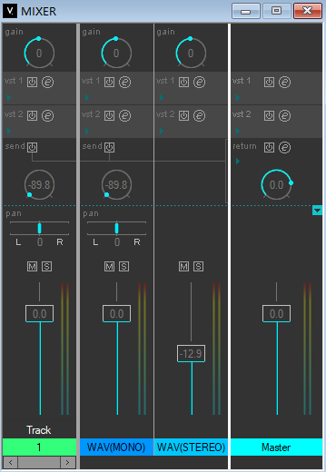

## 在开始之前······

**欢迎来到《面向虚拟歌姬混音》系列混音入门教程！**

正如名字所言，这是一系列为虚拟歌声合成爱好者（或许你更喜欢“调声师”这个称呼）所作的混音教程。 
这篇教程旨在提供最最入门的混音知识普及，这或许不足以让你达到能够接到有偿混音稿子的水平，但起码会让你不再犯下一些显而易“听”的错误：用爆掉的总线电平给听众一点“惊喜”、用撤硕混响把调声赛评委吓跑······

虽然B站上已经有很多前辈制作了不少优秀的混音教程，不过完全从0开始+针对虚拟歌姬的教程似乎少之又少（论文方向get✔），因此这一系列教程除了会从学会DAW的操作开始以外，还会针对常见歌声合成引擎的声音特质作特别讲解，也希望其它混音师朋友在接到这类单子的时候能够提供参考。

同时，本教程所有内容完全免费开放阅读，希望各位能够通过混音间接提高自己的调声水平（？） 
由于作者水平有限，教程中难免会出现纰漏，如果你有任何疑问或建议，可以向教程仓库提交issue，或者加入QQ群聊：[631184573](http://qm.qq.com/cgi-bin/qm/qr?_wv=1027&k=ggIX5kUd7FiyZSuidGjZIMwgF6CJmv6w&authKey=uRb7BJfHLrJDUwNA%2FhECk3Pog9MwiegvyxJOjLB%2FuqjjKvU5TA%2BHJ2VV8jiAeWt4&noverify=0&group_code=631184573)，也可以直接联系作者bilibili[@辰晓CenX](https://space.bilibili.com/13993937)。感谢各位的理解与包容！

废话不多说，让我们进入正题：

## 什么是混音？

艺术？工科？~~玄学？~~ 或许都是。但在本教程中它的通俗定义为“将人声和伴奏和谐地融入到同一个立体声音轨中”，在混音圈子中也通常称之为“贴唱混音”。

> 🤓☝🏼：这么简单？那我把干声和伴奏一起从编辑器里面合并导出是不是也算完成“混音”了？

当然算，只要你认为它们已经足够和谐的话。

你要是真的这么认为的话，也不会看到这里了吧？ 
如果你是VOCLAOID编辑器用户，那么这个界面你一定不会陌生： 
 
它或许是你最早接触到的混音工具，但是由于每个通道只能挂载两个内置或外部VST2插件的限制，也只能勉强进行最基础的混音处理。并且除了VOCALOID系列以外，其它主流歌声编辑器大多也只提供最基础的音量和声像调节功能，如果你有稍微高级一点的功能需求如自动化控制、音频编辑、塞更多的插件等功能，就得请出混音师们的老朋友——DAW（数字音频工作站）了。

那么，怎么才能让这位老朋友干活呢？你先别急，这才第0章呢。在开始阅读下一章节之前，建议先看完本章的下一节“培养审美与运用参考曲目”。
